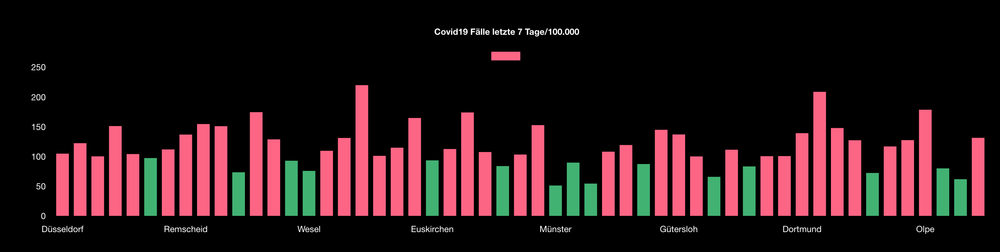

# MagicMirror2-Module: Covid19 Chart

Country: GERMANY  
State: NRW



## Installation

In your terminal, go to your MagicMirror's Module folder:

```
cd ~/MagicMirror/modules
```

Clone this repository:

```
git clone https://github.com/SimHub/
MMM-Covid19
```

Add the module to the modules array in the `config/config.js` file:

```
{
module: "MMM-Covid19",
position: "bottom bar",
config: {
	bl: "Nordrhein-Westfalen"
  }
},
```

#### Options

| options           | default             | type   | value                                                                                                                                                                                                   |
| ----------------- | ------------------- | ------ | ------------------------------------------------------------------------------------------------------------------------------------------------------------------------------------------------------- |
| config:{bl:"..."} | Nordrhein-Westfalen | string | Schleswig-Holstein,Hamburg,Niedersachsen,Bremen,Nordrhein-Westfalen,Hessen,Rheinland-Pfalz,Baden-Württemberg,Bayern,Saarland,Brandenburg,Mecklenburg-Vorpommern,Sachsen,Sachsen-Anhalt,Thüringen,Berlin |
| position          | bottom bar          | string | [full list!](https://docs.magicmirror.builders/modules/configuration.html)                                                                                                                              |
